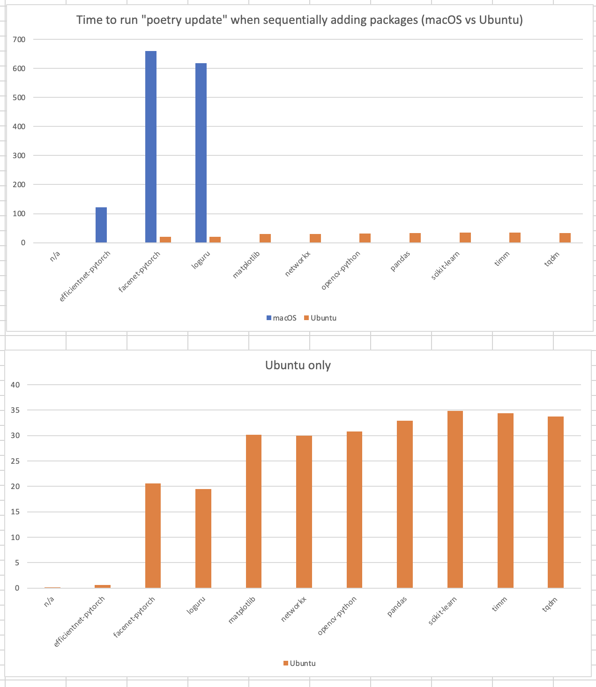

# Poetry Speed Tests

## Is Poetry slower on macOS than Ubuntu?

Lately I've been experiencing `poetry update` routinely taking 60-90 minutes (5000 seconds). I've used Poetry in anger for 6 months now, before that [pip-tools](https://github.com/jazzband/pip-tools) and [conda](https://docs.conda.io/en/latest/). Exceptionally long Poetry compile times feel like a new thing, but I have no hard evidence for this.

### Aren't speed issues well documented by and understood by the Poetry / PyPI / pip maintainers?

Perhaps, there's lots of open issues, but I haven't seen any _systematic_ data collection on this:

  - **[Poetry #2094](https://github.com/python-poetry/poetry/issues/2094)** (_"Poetry is extremely slow when resolving the dependencies"_) discusses the difficulties of missing package metadata causing [Poetry to download and then inspect packages](https://python-poetry.org/docs/faq/#why-is-the-dependency-resolution-process-slow) for dependency resolution; also perhaps some optimisations in the PyPI API. Some of the more recent comments suggest a possible uptick in macOS-related issues?
  - **[Poetry #4924](https://github.com/python-poetry/poetry/issues/4924)** (_"Dependency resolution is extremely slow"_) cover much the same ground.
  - **[Poetry #5194](https://github.com/python-poetry/poetry/issues/5194)** (_"Dependency resolution takes awfully long time"_) mentions issues with pandas and numpy, as well as querying PyPI for private packages. It doesn't mention any OS-specific differences.
  - **[pip #9187](https://github.com/pypa/pip/issues/9187)** (_"New resolver takes a very long time to complete"_) and **[pip #10201](https://github.com/pypa/pip/issues/10201)** (_"Resolver preformance regression in 21.2"_) document various issues such as [backtracking](https://pip.pypa.io/en/stable/user_guide/#dependency-resolution-backtracking) and optimizations for the pip resolver itself.

### Why does Poetry need to download packages to get dependencies?

As mentioned in [Poetry's docs](https://python-poetry.org/docs/faq/#why-is-the-dependency-resolution-process-slow), one big issue is whether packages include metadata that defines their dependencies. If they do, then the PyPI API can return all this information to Poetry. If they don't, then Poetry must download the package in order to inspect its `setup.py` to determine required dependencies at install time.

[Dustin Ingram](https://dustingram.com/articles/2018/03/05/why-pypi-doesnt-know-dependencies/) wrote a fantastic blog post explaining this, for example `setup.py` may contain code that inspects the environment in order to install different dependencies for Windows vs macOS. This may be very reasonable in e.g. deep learning libraries with architecture-dependent dependencies. [PEP 517](https://www.python.org/dev/peps/pep-0517/) helps with this.

### How big a problem is this?

`poetry update` is now routinely taking over an hour. That's a 5000s delay for everyone in our team before they can push code to CI. We've removed our [`poetry-lock` pre-commit hook](https://pre-commit.com/) to side-step this, but now we're seeing more CI failures and lock files that don't match `pyproject.toml`. Running all our pre-commit hooks (including `poetry lock --no-updates`) _used_ to take roughly the time for a kettle to boil, that's an acceptable (and welcome) break in our workflow.

### What's causing this?

I compared `poetry update` across two environments: MacBook Pro (my local machine) vs Ubuntu (Google Cloud Platform). Running `poetry update` locally in a fresh repo (with all caches cleared) took 3700s to resolve the dependencies on the MacBook Pro. On Ubuntu on GCP, it took 120s.

**Ubuntu running in GCP runs `poetry update` 30x faster than my local machine!**

That's a huge insight! There are three culprits:
1. Network speed
2. Ubuntu vs macOS
3. Hardware architecture

#### Is it network speed?

Definitely! This is mentioned in the Poetry Github issues and explains _most_ of the difference in dependency resolution time. The Ubuntu GCP machine was clocking 2300 Mbps download speed via `speedtest`. My local machine was clocking 80 Mbps download speed. That explains a 30x difference in `poetry update` resolution time.

You can see why by running `poetry update -vvv` on e.g. a simple pandas-only environment, clearly showing the repeated network calls to the PyPI API. Regardless, the PyPI API can be quite slow. A step like `PyPI: Getting info for pytz (2021.3) from PyPI` isn't downloading packages, its just an API call, but still takes 10s on my local network. Steps like `PyPI: Downloading sdist: numpy-1.22.2.zip` which require downloading multiple versions of numpy for dependency inspection cause the bulk of the 90 seconds spent resolving a pandas-only environment.

🔥 **Tip #1: Faster internet might give you _much_ faster Poetry performance.** (Going from 70Mbps to 400Mbps by plugging into my ethernet cable reduced dependency resolution times considerably.)

#### Is there an OS-level difference?

Reading the Poetry docs, there could be OS-level differences in `setup.py` that cause variation between the environments. Perhaps there's a "problem" package that resolves different on macOS? I added packages one-by-one into each environment, timing every step of the way. Here's the results.

So, it seems that including [facenet-pytorch](https://github.com/timesler/facenet-pytorch) in the environment gives a step change in both macOS dependency resolution time (100s to 600s), so something about this package is definitely slowing things down considerably.

This is not hugely important though. Installing an environment that _only contains pandas_ takes 10s on Ubuntu vs 80s on macOS, so macOS is _much_ slower than the GCP Ubuntu box regardless of the package we're adding.

#### Can we compare Ubuntu vs macOS, controlling for architecture & network speed?

Yes! [This Github repository](https://github.com/john-sandall/poetry-speed-test/) has Github Actions configured to run `poetry update` on identical `pyproject.toml` in both Ubuntu and macOS (Github Actions is pretty cool!).

The results: [Ubuntu takes 125 seconds](https://github.com/john-sandall/poetry-speed-test/runs/5245734907?check_suite_focus=true) to lock [this pyproject.toml](https://github.com/john-sandall/poetry-speed-test/blob/main/pyproject.toml) whereas [macOS takes 145 seconds](https://github.com/john-sandall/poetry-speed-test/runs/5245734945?check_suite_focus=true).

  - **Lesson #1:** Both are very fast. We're talking a couple minutes for an environment that takes over 5000s to compile on my local machine.
  - **Lesson #2:** Using Github Actions, macOS is still between 15% - 50% slower than Ubuntu across different runs. There _might_ be something in this?

## What can be done?

  - **Action #1:** Network speed is critical to `poetry update` time. If you can use ethernet to boost your speed from 50 Mbps -> 300 Mbps, you might see a 6x reduction in Poetry performance.
  - **Action #2:** Some packages are much slower. I'm curious to know more about when metadata cannot be included. Is there a gap in PEP standards that cannot be closed for some packages? Or does this require some effort to add the right metadata to these packages? Is it worth building https://pyreadiness.org/3.10/ for "has PyPI API friendly metadata?"
  - **Action #3:** Use Poetry in CI!

### Run Poetry in CI!

Right now, this is a killer productivity win for us! (And our clients.) 🔥🚀

This repo contains a Github Action, [`poetry-lock-export.yml`](https://github.com/john-sandall/poetry-speed-test/blob/main/.github/workflows/poetry-lock-export.yaml), that runs poetry update/lock/export against `pyproject.toml`. Simply copy this into your own repo's `.github/workflows/` folder and you're good to go!

#### Usage
This is cumbersome, but let's remember it's _much_ faster than waiting 5000s to do `poetry add pandas` locally!

1. Check latest package version on PyPI, e.g. for [pandas](https://pypi.org/project/pandas/) we'd add `pandas = "^1.4.0"` to `pyproject.toml`.
2. Commit, run pre-commit (our `poetry-lock` is manual stages only, so won't run here), push.
3. Run your new [Poetry lock and export](https://github.com/john-sandall/poetry-speed-test/actions/workflows/poetry-lock-export.yaml) Github Action against the branch you're working on, put the kettle on, and within 2 minutes it will have run poetry update, poetry lock, poetry export, and [sent you a Pull Request](https://github.com/john-sandall/poetry-speed-test/pulls?q=is%3Apr+) (against that same branch) for you to merge into your working branch.

I'm writing this up because a) this feels not at all correct!, b) perhaps someone can help us find sanity, and c) until then, I hope this workaround helps save people a huge amount of time.

### What next?
I'm now curious to learn more about dependency resolution algorithms, it's clearly a hard problem with hidden complexities! Perhaps this investigation inspires you to learn more also? Perhaps, like me, you could:
  - 📦 Attend the next [Python Packaging Summit](https://us.pycon.org/2020/hatchery/packaging/)?
  - 🪶 Try to adapt [Airspeed Velocity](https://github.com/airspeed-velocity/asv/) for consistently measuring dependency resolution algorithms in tools like pip and Poetry?
  - 💵 Be paid to fix this! The Python Software Foundation is looking to [pay 1x backend developer and 1x frontend developer up to $98,000 each](https://pyfound.blogspot.com/2022/02/we-are-hiring-contract-developers-to.html) to work on improving PyPI.

---
## Repo Development Guide

This repo was created using the [Coefficient Cookiecutter](https://github.com/CoefficientSystems/coefficient-cookiecutter).
### Project cheatsheet

  - **pre-commit:** `pre-commit run --all-files`
  - **pytest:** `pytest` or `pytest -s`
  - **coverage:** `coverage run -m pytest` or `coverage html`
  - **poetry sync:** `poetry install --no-root --remove-untracked`
  - **updating requirements:** see [docs/updating_requirements.md](docs/updating_requirements.md)
- **create towncrier entry:** `towncrier create 123.added --edit`

### Initial project setup

1. See [docs/getting_started.md](docs/getting_started.md) or [docs/quickstart.md](docs/quickstart.md)
   for how to get up & running.
2. Check [docs/project_specific_setup.md](docs/project_specific_setup.md) for project specific setup.
3. See [docs/using_poetry.md](docs/using_poetry.md) for how to update Python requirements using
   [Poetry](https://python-poetry.org/).
4. See [docs/detect_secrets.md](docs/detect_secrets.md) for more on creating a `.secrets.baseline`
   file using [detect-secrets](https://github.com/Yelp/detect-secrets).
5. See [docs/using_towncrier.md](docs/using_towncrier.md) for how to update the `CHANGELOG.md`
   using [towncrier](https://github.com/twisted/towncrier).
